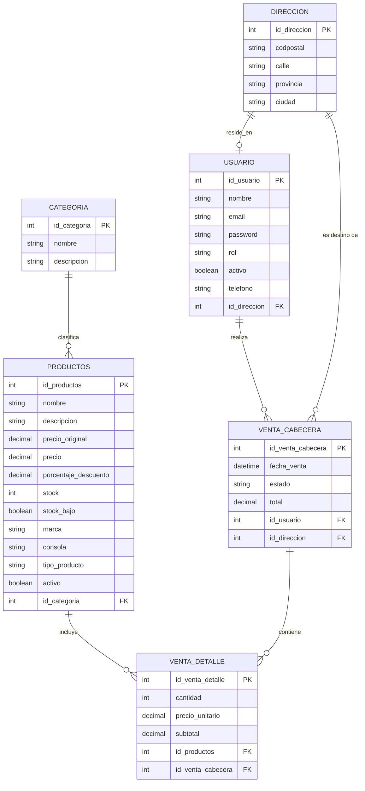

# Modelo Relacional (DER)

## Descripción General

El siguiente modelo relacional representa la estructura final de la base de datos del sistema de **Retro Games**, resultado del proceso de normalización (1FN, 2FN y 3FN) detallado en `normalizacion.md`. Está compuesto por seis entidades relacionadas entre sí mediante claves foráneas (FK), que permiten gestionar el catálogo de productos, las categorías, los usuarios, las direcciones y el registro de ventas.

---

## Entidades y Atributos

### Tabla: `categoria`

| Campo | Tipo de Dato | Restricciones |
| :--- | :--- | :--- |
| **`id_categoria`** | INT | **Primary Key (PK)** |
| `nombre` | VARCHAR | NOT NULL |
| `descripcion` | VARCHAR | |

### Tabla: `productos`

| Campo | Tipo de Dato | Restricciones |
| :--- | :--- | :--- |
| **`id_productos`** | INT | **Primary Key (PK)** |
| `nombre` | VARCHAR | NOT NULL |
| `descripcion` | VARCHAR | |
| `precio_original` | DECIMAL | |
| `precio` | DECIMAL | NOT NULL |
| `porcentaje_descuento` | DECIMAL | |
| `stock` | INT | |
| `stock_bajo` | BOOLEAN | |
| `marca` | VARCHAR | |
| `consola` | VARCHAR | |
| `tipo_producto` | VARCHAR | |
| `activo` | BOOLEAN | |
| `id_categoria` | INT | **Foreign Key (FK)** -> referencia a `categoria` |

### Tabla: `direccion`

| Campo | Tipo de Dato | Restricciones |
| :--- | :--- | :--- |
| **`id_direccion`** | INT | **Primary Key (PK)** |
| `codpostal` | VARCHAR | |
| `calle` | VARCHAR | |
| `provincia` | VARCHAR | |
| `ciudad` | VARCHAR | |

### Tabla: `usuario`

| Campo | Tipo de Dato | Restricciones |
| :--- | :--- | :--- |
| **`id_usuario`** | INT | **Primary Key (PK)** |
| `nombre` | VARCHAR | NOT NULL |
| `email` | VARCHAR | NOT NULL, UNIQUE |
| `password` | VARCHAR | NOT NULL |
| `rol` | VARCHAR | NOT NULL |
| `activo` | BOOLEAN | |
| `telefono` | VARCHAR | |
| `id_direccion` | INT | **Foreign Key (FK)** -> referencia a `direccion` (opcional) |

### Tabla: `venta_cabecera`

| Campo | Tipo de Dato | Restricciones |
| :--- | :--- | :--- |
| **`id_venta_cabecera`** | INT | **Primary Key (PK)** |
| `fecha_venta` | DATETIME | NOT NULL |
| `estado` | VARCHAR | NOT NULL |
| `total` | DECIMAL | NOT NULL |
| `id_usuario` | INT | **Foreign Key (FK)** -> referencia a `usuario` |
| `id_direccion` | INT | **Foreign Key (FK)** -> referencia a `direccion` |

### Tabla: `venta_detalle`

| Campo | Tipo de Dato | Restricciones |
| :--- | :--- | :--- |
| **`id_venta_detalle`** | INT | **Primary Key (PK)** |
| `cantidad` | INT | NOT NULL |
| `precio_unitario` | DECIMAL | NOT NULL |
| `subtotal` | DECIMAL | NOT NULL |
| `id_productos` | INT | **Foreign Key (FK)** -> referencia a `productos` |
| `id_venta_cabecera` | INT | **Foreign Key (FK)** -> referencia a `venta_cabecera` |

---

## Relaciones y Cardinalidades

| Relación | Cardinalidad | Descripción |
| :--- | :--- | :--- |
| `categoria` → `productos` | **1..N** | Una categoría puede agrupar muchos productos; cada producto pertenece a una única categoría. |
| `productos` → `venta_detalle` | **1..N** | Un producto puede aparecer en muchos detalles de venta; cada detalle referencia a un único producto. |
| `venta_cabecera` → `venta_detalle` | **1..N** | Una venta (cabecera) puede tener muchos ítems de detalle; cada detalle pertenece a una única venta. |
| `usuario` → `venta_cabecera` | **1..N** | Un usuario puede realizar muchas ventas; cada venta es realizada por un único usuario. |
| `direccion` → `venta_cabecera` | **1..N** | Una dirección puede usarse como destino de muchas ventas; cada venta tiene una única dirección de entrega. |
| `usuario` → `direccion` | **1..1** (opcional) | Un usuario puede tener asociada una dirección propia; una dirección corresponde a un único usuario en este vínculo. |

---

## Diagrama Entidad-Relación

